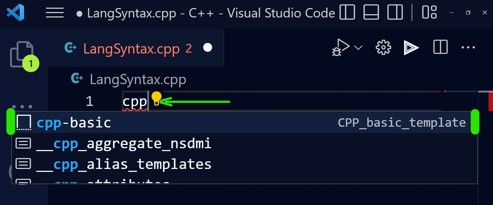

# langsyntax README

## Features

    An extension that helps you with the structure syntax

## Supported languages
  - C++

## Release Notes
### v1.0.0
  - Initial Release
  - Added Structures for C++

### v1.1.0
  - Added logo
  - Changed compatibility version

## How to use

> Below you'll find a list of commands. You have to write them in the editor, so it will generate the structure you are invoking.

> 

## Commands
  ### C++
  - cpp-basic -> Basic C++ structure
  - var-cpp -> Variable structure
  - cond_op-cpp -> Conditional operator structure
  - if-cpp -> If structure
  - while-cpp -> While loop structure
  - do_while-cpp -> Do-While loop structure
  - for-cpp -> For loop structure
  - array-cpp -> Array structure
  - function-cpp -> Function structure